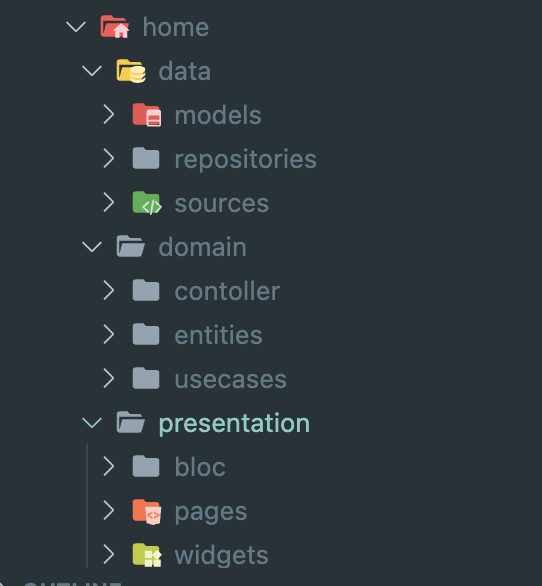
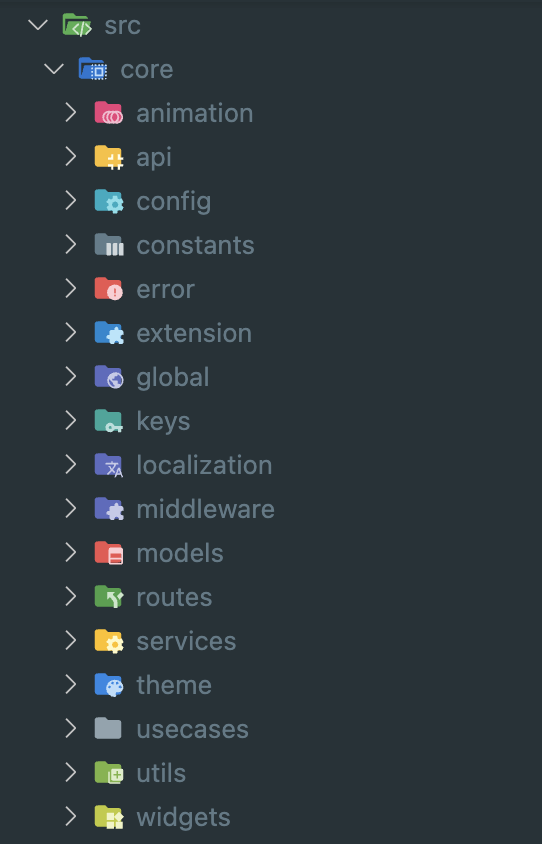

## Flutter Clean Folder Architecture: Saving Time and Simplifying Development.

## Introduction

Inspired by the [Sudesh Bandara], this extension will help you quickly scaffold a Feature Folder, Core Folder, and Generate classes.

| Feature Folder | Core Folder |
| ------ | ------ |
|  |  |

## Installation

This extension can be installed from the [VSCode Marketplace] or by [searching within VSCode]().

### How to Feature Command Usage

###### You can activate the command by launching the command palette (View -> Command Palette) and running.
- `Onyxsio : Generator feature folder`
- `Onyxsio : Generator core folder`
- `Onyxsio : Generate from class properties`
- `Onyxsio : Generate from JSON`

Or you can right click on the directory in which you'd like to create the feature and select the ``New Feature`` command from the context menu.
#### _Revolutionize Your Flutter Projects with Efficient Folder Structures._

In the fast-paced world of app development, time is of the essence. Flutter, the open-source UI software development toolkit, has gained immense popularity for its flexibility and ease of use. However, managing large-scale Flutter projects efficiently can be a daunting task without a clear organizational structure. This is where the concept of "Clean Folder Architecture" comes into play. In this article, we will explore how implementing a clean folder architecture in your Flutter projects can save you valuable time and simplify the development process.

### What is Clean Folder Architecture?
Clean Folder Architecture is a software design pattern that emphasizes organizing project files and directories in a logical and coherent manner. By structuring your Flutter project into distinct modules, layers, and components, you create a clear separation of concerns, making it easier to navigate, maintain, and scale your codebase.

 Flutter Clean Architecture is a design pattern that promotes separation of concerns and maintainability of code by organizing it into different layers: Presentation, Domain, and Data. Here's how you can structure your Flutter project using the Clean Architecture approach:

### 1. Presentation Layer:
   - **Widgets:** Contains the UI components of your application. Separate folders can be created for each feature or screen.
   - **Screens:** UI screens of your application, organized by features.
   - **ViewModels or Blocs:** Business logic for UI components. You can use Provider, Riverpod, Bloc, or any other state management solution here.

### 2. Domain Layer:
   - **Use Cases:** Contains application-specific business rules and logic.
   - **Entities:** Plain Dart objects representing the core data models of your application.
   - **Repositories Interface:** Abstract classes defining methods for data operations. Actual implementations will be in the Data layer.

### 3. Data Layer:
   - **Repositories Implementation:** Implement the repository interfaces defined in the Domain layer. This is where you interact with external data sources like APIs or databases.
   - **Data Sources:** APIs, databases, or any external data providers.
   - **Models:** Data models specific to the data layer. They can be different from entities in the domain layer to accommodate data source specifics.

### 4. Core Folder:
   - **Network:** Code related to making API calls and handling network requests.
   - **Database:** Code related to local database storage (if applicable).
   - **Routes:** Define your application routes and navigation logic here.
   - **Helpers:** Utility classes and functions that can be used across the application.
   - **Constants:** Application-wide constants.
   - **Extensions:** Dart extensions for built-in classes.
   - **Localization:** Language translations and localization files.

### 8. Configs:
   - **Environment Config:** Configuration files for different environments (development, production, staging, etc.).

[VSCode Marketplace]: <https://marketplace.visualstudio.com/items?itemName=sudeshbandara.sudesh>
[Sudesh Bandara]: <https://sudeshnb.xyz>
